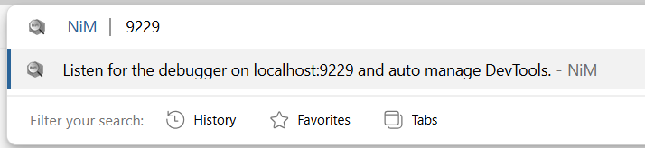

<!--The ratings badges are currently broken due to [this](https://github.com/badges/shields/issues/5475) and [this](https://github.com/pandawing/node-chrome-web-store-item-property/issues/275#issuecomment-687801815).-->

|| Click on the GIF to see the smoother flowing real thing!   |
|---|---|
|||

# Node.js (V8) --inspector Manager
## Streamlined JavaScript V8 (Node.js/Deno) Development

(works with ANY Chromium browsers: [Google Chrome](https://www.google.com/chrome/), [Microsoft Edge](https://www.microsoft.com/edge), [Arc](https://arc.net/), [Opera](https://www.opera.com/), [Vivaldi](https://vivaldi.com/), [Brave](https://brave.com/), [Epic](https://www.epicbrowser.com/), and more...)

* [Google Chrome Web Store](https://chromewebstore.google.com/detail/nodejs-v8-inspector-manag/gnhhdgbaldcilmgcpfddgdbkhjohddkj?utm_source=github&utm_medium=readme&utm_campaign=nim&utm_content=1)
       

* [Microsoft Edge Add-ons](https://microsoftedge.microsoft.com/addons/detail/nodejs-v8-inspector-ma/injfmegnapmoakbmnmnecjabigpdjeme)

## `about:_` is > than `about::inspect`, and Other Reasons to Use NiM...

NiM intelligently manages the browser DevTools window/tab lifecycle and the V8 debugger process.

Besides being the [OG solution to the problem of copy/paste DevTools URL's or continue opening/closing tabs/windows](https://nim.june07.com/#og), NiM continues to offer many additional benefits outside of that original use case.

#### NiM provides you with lots of options...
||||
|---|---|---|
||||
 
* Manage and monitor local and remote debugging sessions
* Manual or automatic control of DevTools interface
* Open DevTools in a new tab or window
* Make DevTools focused or inactive on start
* Customize duration between v8 Inspector probes
* Receive **helpful notifications** from 3rd party services such as your CI/CD pipeline
* Quickly **hot-swap DevTools versions** on the fly within the same browser to work around any upstream bugs in Chrome/Edge DevTools
* **DevTools tab grouping** for improved organization and separation of concerns
* **Resume debugging to the first breakpoint** when using `--inspect-brk`
* Capture **debugging statistics**

and then [load the extension unpacked](https://developer.chrome.com/docs/extensions/mv3/getstarted/development-basics/#load-unpacked)

## Need Additional Information?
* Post install page provides some help [https://blog.june07.com/nim-install](https://blog.june07.com/nim-install/)
* Debugging NiM itself [https://blog.june07.com/debugging-nim/](https://blog.june07.com/debugging-nim/)
* [More Blog Updates](https://blog.june07.com/tag/nim/)

#### If you enjoy using NIM please give us a 5 star rating and review
* [Chrome Web Store Reviews](https://chromewebstore.google.com/detail/nodejs-v8-inspector-manag/gnhhdgbaldcilmgcpfddgdbkhjohddkj)
* [Microsoft Edge Add-ons Reviews](https://microsoftedge.microsoft.com/addons/detail/nodejs-v8-inspector-ma/injfmegnapmoakbmnmnecjabigpdjeme)

Any and all feedback is encouraged and welcome. [Send us an email!](mailto:667@june07.com)

***PLEASE NOTE***: Installing this does require the sharing of your email address with me (and only me). You are given other notice of this, but [it's become and remains such an issue](https://blog.june07.com/foff/) that I feel the need to make it OVER-abundantly clear. If you take issue with sharing your email address with me (mine is 667@june07.com by the way) please, I implore you to clone/fork a copy yourself and change what you don't like about the code and/or use alternate solutions (none of which are as good as NiM, but call me biased). Further feel free to contact me directly and have a chat. Unlike the behemoths like Facebook, Google, Amazon that you probably (and without hesitation) share your email address with, I actually care about the concerns of the actual people who choose to use the code I wrote (~99%) and am responsible for.

[terms of service](https://terms.june07.com)
[privacy policy](https://privacy.june07.com)

Thank you so much.
